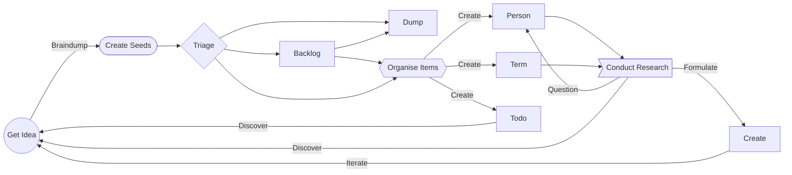

> ⚠️ If you are viewing this on [obsidian.garden](https://obsidian.garden) please be aware that [Obsidian Publish](https://help.obsidian.md/Plugins/Publish) does not yet support community plugins so not all featured are rendered - the project is best viewed in [Obsidian](https://obsidian.md) desktop.

# 👋 Welcome to your Knowledge Garden

[🪨  🌳  Obsidian Garden] is a open-source guide to creating your own [🌳  Digital Garden] with [Obsidian](https://obsidian.md).

The garden is contained within in it's own [🗃  Knowledge Management System] - designed as a template for you to learn the basics of working with [🪨  Obsidian] and extend and remix in to your own.

![🖇 Attachments/the-knowledge-garden.png]

## 💾 Installing The Guide

The easiest way to start is clone [this GitHub repository](https://github.com/tanepiper/obsidian-garden) containing the most up to date version, or download it as a zip file.

> `git clone https://github.com/tanepiper/obsidian-garden.git`

Then you can open in [🪨 Obsidian] - make sure the [🔌  Plugins & 🌈  Theme] are also installed.

> ⚠️ The Obsidian Garden is currently in active development and evolving - it's being developed in the open but is subject to changes, and may contain broken links and errors

## 🔗 Creating Connections

💡 Great ideas happen when there is an [connection] between knowledge and inspiration.

For thousands of years humans have tried to make sense of the world around them. Scientists, philosophers, writers, and even you and [I] try to categorise it, understand how it works and create [systems] that allow us to store and process this knowledge.

Each time this has allowed new ideas to form, adding to the collective [Knowledge Graph] from which more build on - but in our modern world there are so many distractions and so much new information to process that it can be really hard to see the [links] between things.

From our own minds, to a collection of half-filled notebooks in a drawer and from a bookshelf of unread books to your nearest library - all contain the inspiration we need to think of our next great idea.

## 💩 Avoiding Information Rot

⛔️ When it come to storing our ideas - in the worst-case we use only our brain.

When we do this, an idea can only exist within the boundaries of our own imagination. No one else yet knows about your idea (unless there is a [Multiple Discovery](https://en.wikipedia.org/wiki/Multiple_discovery) - but this also means you're losing out).

Without communicating this idea the first real risk in [Information Rot] is you!

In the west, oral tradition is unreliable - telling people about your idea is great, but passed on information tends to be unreliable and incomplete. Only the source is truly reliable, and even then at risk of forgetting details.

The only way to truly capture an idea is to write it down, draw it, or record it. Even here there's a risk that without one single place to put it all - you will miss out on [connecting] it all together.

In [Knowledge Management] systems there is concept of the _"second brain"_ - a dynamic and visual hard drive that we can consciously put our stream of thoughts and ideas in to.

On top of this we build the [📇 Terms/🧠 Knowledge Systems/🌳 Digital Garden] idea - in this guide known as the **Knowledge Garden** - this is not a new idea, instead we build on this concept and use it as a base template to show a working system.

## 🧠 Creating a second brain

Using [Obsidian] and this guide you can use it to create your own system - either by extending, or creating your own from scratch.

By extending Obsidian with [🔌 Plugins and a 🌈 Theme] we can start to build with more functionality for creating and querying the underlying data.

This guide is designed to get you starting in understanding why a [Knowledge Garden] is useful and to help reduce the learning curve.

## 🌺 Letting Ideas Flourish

⏳ Like a real garden, good ideas need nurtured and take time to grow - but can reap rewards when cared for correctly.

To escape the distractions of life we can visit our [Obsidian Garden|Knowledge Garden] to reconnect with [🌱 new] and [🪴 old](-grow-room.md) knowledge and create [links] between them so we can see the [Knowledge Graph] that connects them.

Adding enhanced richness with `#tags` and `Variables::` allows us to perform [searches] and [build queries] that allow us to [🎯 Create Custom Dashboards] and code blocks that let us see through the overgrowth of all the data - display tables, and lists - both basic to do items.

Every [person's](-people.md) garden is different - some are neatly manecured and ordered, while some are more organic and wild - both need nurturing and tending too.

### 🏄‍♂️ Suggested flow

The suggested flow shows one way of thinking how items are handled - when you have an idea (or want to collect a link, a picture of a doodle, create a contact) you can start with a [⏣ Templates/🗒 Basic Note] - or select a more detailed ⏣ Template.

All items start in the 🌱 Seed Box - an inbox for all items that need [triage].  Items can then go into the immediate 🪵 Backlog, or be categorised and filed - once items have been created they create new opportunities for new ideas to be created.



---

> ✅ This set of tools is released under Creative Commons Zero v1.0 Universal [LICENSE](license.md)

> If you are looking for a more fully featured [Knowledge Management] system check out [LytKit](https://publish.obsidian.md/lyt-kit/_Start+Here)

---

%%
Once you're ready, feel free to change this readme and turn it into your home dashboard.
%%

## 🪵 Current Backlog

```dataview
table file.ctime as "Planted at" 
from "🪵 Backlog"
sort file.ctime DESC
```

## 🌱 Seed Box Latest 5

```dataview
table file.ctime as "Planted at" 
from "🌱 Seed Box"
sort file.ctime DESC
limit 5
```

## 5️⃣ Last 5 Files Edited

```dataview
table file.mtime as "Last tended to"
where file.mtime < (date(today) + dur(1 day))
sort file.mtime DESC
limit 5
```
